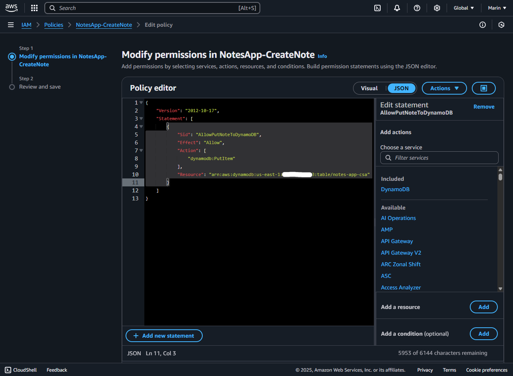
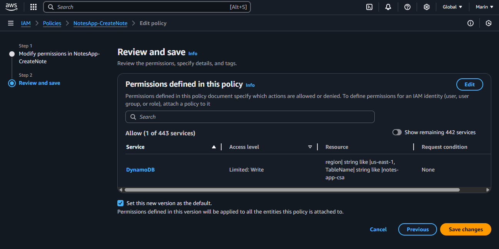
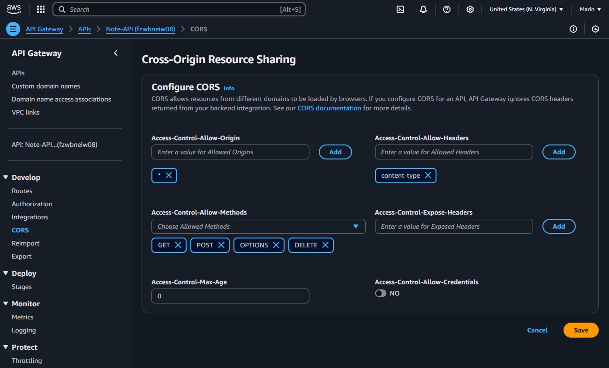

# Cloud Based Notes App

Small notes app that uses AWS Lambda and DynamoDB for serving and persisting notes created by users and has the ability to store attached files.

# Functionalities
- Create notes and optionally attach a file.
- Fetch all notes
- Fetch a single note
- Deletion of a Note alongside its attecehd files from the services.

# Setup Process
To achieve this we will need a few things:
- Setup a DynamoDB table.
- Setup an S3 bucket for storing atteched files.
- Setup an AWS Lambda Functions to:
    - Create Notes.
    - Fetch All Notes.
    - Get a Specific Note.
    - Delete a Note.
    - Provide a pre-signed upload URL
- Setup IAM Roles to grant permissions to the lambdas.
- Setup an API Gateway to forward calls to each lambda.
- Setup a Front-end to interact with the API Gateway.

---
Below are the steps as to how this was achieved.
---

# Setup a DynamoDB Table
In your AWS dashboard go to `DynamoDB`.
Once in the dashboard click on `Create Table`.

Here create a name, in this case `notes-app-csa`.

Then create a `Partition Key` this serves as the Primary Key identifier of each entry.

Then add a `Sort Key` this serves as the orginizer and works combined with the partition key.

If both are setup a Partition Key can be shared among two entries if their sort key is different, A partition key could be the UserID and the sort Key the date of creation, making it easy to retrieve all objects as a 'block' using the Partition key and the Sort Key to get some filters if needed.

In this case because there will be no users the Partition Key is going to serve as an unique identifier and we will try to make sure it does not collide between notes, so I created `NotesID` as the Partition and `CreatedAt` as the Sort key, both as Strings.

Then click on `Create Table`


# Setup S3 for File Storage
In your AWS dashboard go to `S3`.
Once in the dashboard click on `Create Bucket`.

Select a name, in this case `notes-app-files-csa`.

Leave everything on defaults because we will be granting permissions on the next steps.

Then click on `Create Bucket`


# Setup Lambda
Now lets create the lambda functionallity to bring together both DynamoDB and S3 for storing the data of our Notes.

Here we will be making ONE lambda for each operation to keep it scalable and manageable.

So in your AWS Dashboard go to `Lambda` and then click on `Create Lambda`, name each lambda and select `Node.js` as the Runtime and the architecture as x86_64.

We will need 5 Lambdas:
- Create Note
- Delete Note
- Search By Id
- Search All
- Create Presigned URLs


*Note: This is only ONE lambda creation to avoid repetition of images*

## Setup Create Note Lambda
I called this lambda 'Notes-POST-Note', this will be in charge of creating an entry in the DynamoDB with the note data.

First let's see the definition of a note, a note will have these fields:

### Sample Note
* NoteID (UUID)
* Title (String)
* Content (String)
* CreatedAt (TimeStamp)
* FileURL (S3 URL)

With this in mind lets create our lambda function.

### Create Node Code
In our lambda function lets add the following code.

```JavaScript
import { v4 as uuidv4 } from 'uuid';
import { DynamoDBClient, PutItemCommand } from "@aws-sdk/client-dynamodb";

export const handler = async (event) => {
    const body = typeof event.body === 'string' ? JSON.parse(event.body) : event.body;
    const noteId = uuidv4();
    const createdAt = new Date().toISOString();
    let fileUrl = body.fileUrl || null;

    //Manages the DynamoDB communication
    const db = new DynamoDBClient({region: 'us-east-1'});

    await db.send(new PutItemCommand({
        TableName: process.env.NOTES_TABLE_NAME,
        Item: {
            NoteID: {S: noteId},
            Title: {S: body.title},
            Content: {S: body.content},
            CreatedAt: {S: createdAt},
            ...(fileUrl ? { FileUrl: { S: fileUrl } } : {})
        }
    }))

    return { 
        statusCode: 201,
        body: JSON.stringify({
            NoteID: noteId,
            Title: body.title,
            Content: body.content,
            CreatedAt: createdAt,
            FileURL: fileUrl || null
        })
    }
};
```

Now as you can see this requires the module `UUID` which is not bundled with the Node 22.x execution runtime of AWS, so we will be adding it as a Layer, this will be done as follow:

### Creating layer for UUID module
AWS requires a specific folder layout, so we will be following it by creating folders as follow

Create a folder called `uuid-layer` then a folder inside called `nodejs`, then inside of it we are going to init a Node project to be able to install the module using npm.

Bash:
```Bash
mkdir -p uuid-layer/nodejs
cd uuid-layer/nodejs
npm init -y
npm install uuid
```

Then go into the `lambda-layer` folder and zip the `nodejs` folder


Bash:
```
cd ..
zip -r uuid-layer.zip nodejs
```

#### Uploading Layer
Now inside the lambda function page expand the left side menu and click on `Layers` under Aditional Resources section and click `Create Layer`

Inside the Create Layer page name your Layer, in this case UUID and optionally add a description.

Then click on `Upload a .zip file` and click `choose file`, navigate to where the nodejs.zip file is and select it.

Add `x86_64` as architecture and `Node.js 22.x` as runtime.

Then click `Create`


### Attach the Layer containing UUID Module
Now that the layer is setup properly, go back to the `Lambda Function` dashboard and scroll down till the `Layer` section and click on `Add a Layer`

Here select `Custom Layer` and in the drop down menu of `Custom Layer` select the layer that you just created and then a `Version`, it should be only one.

Then click on `Add`


### Adding Env Variables
As you can see, the code above references `process.env.`, so the lambda function expects env variables to be set, you can skip this step by manually putting the Table and S3 names in the code.

If you want to keep the variables you'll need to go into the `Configuration` tab of the lambda function, then `Enviroment Variables` and then click `Edit`.

Here you will need two keys:
```
NOTES_TABLE_NAME
```

And set each value with the exact name of the S3 bucket and DynamoDB table we created earlier.


Then click `Save`.


#### Deploy the Function
Now the last step is to `Deploy the Lambda`, to do this go to the Lambda Function page and inside the editor click on the `Deploy` button and wait for the confirmation message.

Now this lambda function is ready.

## Setup Get All Notes Lambda
Now let's create a Lambda that fetches and returns all Notes that are inside our DynamoDB table.

To do this we will create another Lambda Function, I named this `Notes-FETCH-ALL-Notes`, follow the same steps as before.

For this we will be using the `scan` function of DynamoDB, this returns ALL entries of a table.

### Fetch All Notes Code
In our lambda function let's all the following code:

```JavaScript
import { DynamoDBClient } from '@aws-sdk/client-dynamodb';
import { ScanCommand, DynamoDBDocumentClient } from '@aws-sdk/lib-dynamodb';

//Change the region you're in
const db = DynamoDBDocumentClient.from(new DynamoDBClient({ region: 'us-east-1' }));

export const handler = async () => {
    try {
        //Calls SCAN (Returns all entries)
        const result = await db.send(new ScanCommand({
            TableName: process.env.NOTES_TABLE_NAME
        }));

        return {
            statusCode: 200,
            body: JSON.stringify(result.Items),
        };

    } catch (err) {
        console.error('Error scanning table:', err);
        return {
        statusCode: 500,
        body: JSON.stringify({ message: 'Failed to fetch notes' }),
        };
    }
};
```

As you can see, this code also relies on Env Variables, as said before, you can hardcode them or add them the same way as before 

#### Setting Up Env Variables
Inside your lambda function go to the `Configuration` tab, then `Enviroment Variables` and add the following key:

And set its `Value` to the name of the DynamoDB table we created earlier.
```
NOTES_TABLE_NAME
```

#### Deploy the Function
Now the function is setup, go to the `Code` section and click `Deploy` to deploy the code.

## Setup Get Note by ID Lambda
Now we need a Fetch By ID lambda function, this will query a single Note by its UUID.

Again we will create another `Lambda Function`, I will cal this `Notes-FETCH-ID-Note`, again keep the same configuration as before for Runtime and Architecture.

### Get By ID Code
Now for this function we need the following code:

```JavaScript
import { DynamoDBClient } from '@aws-sdk/client-dynamodb';
import { GetCommand, DynamoDBDocumentClient } from '@aws-sdk/lib-dynamodb';

//Change the region you're in
const db = DynamoDBDocumentClient.from(new DynamoDBClient({ region: 'us-east-1' }));

export const handler = async (event) => {
    const noteId = event.pathParameters?.id;

    if (!noteId) {
        return {
            statusCode: 400,
            body: JSON.stringify({ message: 'A valid ID of a Note is required' }),
        };
    }

    try {
        const result = await db.send(new GetCommand({
            TableName: process.env.NOTES_TABLE_NAME,
            Key: { NoteID: noteId }
        }));

        if (!result.Item) {
            return {
            statusCode: 404,
            body: JSON.stringify({ message: 'No Note with such ID was found' }),
            };
        }

        return {
            statusCode: 200,
            body: JSON.stringify(result.Item),
        };
    } catch (err) {
        console.error('Error fetching note:', err);
        return {
            statusCode: 500,
            body: JSON.stringify({ message: 'Failed to fetch note' }),
        };
    }
};
```

As you can see, this code also relies on Env Variables, as said before, you can hardcode them or add them the same way as before 

#### Setting Up Env Variables
Inside your lambda function go to the `Configuration` tab, then `Enviroment Variables` and add the following key:

And set its `Value` to the name of the DynamoDB table we created earlier.
```
NOTES_TABLE_NAME
```

#### Deploy the Function
Now the function is setup, go to the `Code` section and click `Deploy` to deploy the code.

## Setup Delete by ID Lambda
Now we need a Lambda to be able to delete any note by using its ID, this will be deleting the entry from DynamoDB as well as the attached file from the S3 Bucket.

To do this we will create another Lambda Function, I named this `Notes-DELETE-ID-Note`, follow the same steps as before.

### Delete by ID Code
For this function we need the following code:

```JavaScript
import { DynamoDBClient } from '@aws-sdk/client-dynamodb';
import { GetCommand, DeleteCommand, DynamoDBDocumentClient } from '@aws-sdk/lib-dynamodb';
import { S3Client, DeleteObjectCommand } from '@aws-sdk/client-s3';

//Change the region you're in
const db = DynamoDBDocumentClient.from(new DynamoDBClient({ region: 'us-east-1' }));
const s3 = new S3Client({ region: 'us-east-1' });

export const handler = async (event) => {
    const noteId = event.pathParameters?.id;

    if (!noteId) {
        return {
            statusCode: 400,
            body: JSON.stringify({ message: 'A valid ID of a Note is required' }),
        };
    }

    try {
        // Attempts to fetch the Note
        const { Item } = await db.send(new GetCommand({
            TableName: process.env.NOTES_TABLE_NAME,
            Key: { NoteID: noteId }
        }));

        if (!Item) {
            return {
                statusCode: 404,
                body: JSON.stringify({ message: 'Note not found' }),
            };
        }

        // Delets the Note attachment from S3 IF exists.
        if (Item.FileURL) {
            const url = new URL(Item.FileURL);
            const key = decodeURIComponent(url.pathname.slice(1));

            await s3.send(new DeleteObjectCommand({
                Bucket: process.env.NOTES_BUCKET_NAME,
                Key: key
            }));
        }

    // Deletes the entry from DynamoDB
    await db.send(new DeleteCommand({
        TableName: process.env.NOTES_TABLE_NAME,
        Key: { NoteID: noteId }
    }));

    return {
        statusCode: 200,
        body: JSON.stringify({ message: `Note ${noteId} and associated file deleted.` }),
        };
    } catch (err) {
        console.error('Delete error:', err);
        return {
            statusCode: 500,
            body: JSON.stringify({ message: 'Failed to delete note or file' }),
        };
    }
};
```
As you can see, this code also relies on Env Variables, as said before, you can hardcode them or add them the same way as before 

#### Setting Up Env Variables
Inside your lambda function go to the `Configuration` tab, then `Enviroment Variables` and add the following keys:

And set its `Value` to the name of the DynamoDB table and the name of the S3 Bucket we created earlier.
```
NOTES_TABLE_NAME
```
```
NOTES_BUCKET_NAME
```

#### Deploy the Function
Now the function is setup, go to the `Code` section and click `Deploy` to deploy the code.

## Setup Create Presign URL
Now we need a lambda that allows for the creation of a pre-signed URL to upload files into the S3 bucket.

This URL is going to be created using the metadata of the file the user is trying to upload from the frontend, so only that file can be uploaded.

This will allow us to first submit the file to the S3 bucket so that we get an S3 URL that subsequenlty can be provided to the 'Create Note' lambda so the URL get stored in the Database.

This is done to avoid working with `base64` data type in our lambda, if we were to let the user submit the file alongside the metadata, we then be needed to parse the multipart request to get the keys and also the file data, making it more complex and it would lead to a heavier lambda.

So to create this lambda we take the same steps as before, I named this `Notes-S3-Upload-Presign`.

### Create Presign URL Code
For this function we need the following code:

```JavaScript
import { S3Client, PutObjectCommand } from "@aws-sdk/client-s3";
import { getSignedUrl } from "@aws-sdk/s3-request-presigner";

//Be sure to change this region to your own
const s3 = new S3Client({ region: "us-east-1" });

export async function handler(event) {
    const { fileName, fileType } = JSON.parse(event.body);

    //States the file that its going to be uploaded
    const command = new PutObjectCommand({
      Bucket: process.env.NOTES_BUCKET_NAME,
      Key: fileName,
      ContentType: fileType,
    });

    //Creates the URL based on the command created above containing the metadata.
    const url = await getSignedUrl(s3, command, { expiresIn: 300 });

    return {
      statusCode: 200,
      body: JSON.stringify({ uploadUrl: url }),
    };
}
```

As you can see, this code also relies on Env Variables, as said before, you can hardcode them or add them the same way as before 

#### Setting Up Env Variables
Inside your lambda function go to the `Configuration` tab, then `Enviroment Variables` and add the following keys:

And set its `Value` to the name of the name of the S3 Bucket we created earlier.
```
NOTES_BUCKET_NAME
```

## Setup API Gateway
Now that all our lambdas are created, we need a way to comunicate with them to be able to retrieve its response, do to this we will be using `AWS API Gateway` to create differente Endpoints and expose them as a REST API that will trigger our lambdas functions.

To do this go to your `AWS Console` and go to `API Gateway`

Here we click on `Create API`

Then select `HTTP API`

In the next screen create a Name for the API Gateway and under `Integration` add 4 integrations of type `Lambda` and in the drop down menu select each lambda that we created before.

Then click `Next`


Now in the `Configure Routes` step, we will be defining the endpoints of our API, here we want to select a correct `HTTP Method` and `Resource Path`

Here I setted up like this:

*Create a Note Lambda*
```http
POST /api/notes
```

*Fetch all Notes Lambda*
```http
GET /api/notes
```

*Fetch by Note ID Lambda*
```http
GET /api/notes/{id}
```

*Delete by Note ID Lambda*
```http
DELETE /api/notes/{id}
```

*Create Presigned URLs*
```http
POST /api/s3/upload
```

Then click `Next`


In the `Stages Screen` left the default stage with the auto-deploy option on.

Then click `Next`


Now in the `Review Screen` check that everything is setup properly and click `Create` to create the API Gateway.


Now the API gateway should be looking like this in the Dashboard


Now that the API Gateway is ready to go we are one step closer to finish our Cloud Note App but before start testing we need one more thing: **Permissions**

At this point we have an S3 bucket, a DynamoDB Table, 5 Lambdas to operate with them and an API Gateway for outside access.

But AWS follows the `Principle of Least Privilege`, and even though we 'connected' our lambdas with S3 and Dynamo programatically, this doesn't mean they can communicate with them, we need to `grant them permissions` so our connection actually goes through.

In the next step we will be creating custom policies and attaching them to each `Lambda Role`, because of how we created our lambdas, each one has it's own role created by default, so we just need to attach the policies.

Here is how to do it:

## Grant Permissions to Lambdas
Now as we know each Lambda that we created has is own `Role` because we selected `Create basic role with Lambda Permissions`, this will help us attach only the required policies to each lambda so they have only the required permissions to perform their operations.

So the next step is create a policies to attach the required permissions that each role requires.


### Grant Acces to Create Note Role
Lets create a policy for the Create Note, this policy will:
- Grant access to write in DynamoDB.

Go to `IAM` dashboard and then `Policies`, then click on `Create Policy`

In the `Create Policy Editor` select `JSON` and add the following permission definition:

Here you will be changing each `resource` placeholders `<placeholder>` with your actual data

```JSON
{
    "Version": "2012-10-17",
    "Statement": [
        {
            "Sid": "AllowPutNoteToDynamoDB",
            "Effect": "Allow",
            "Action": [
                "dynamodb:PutItem"
            ],
            "Resource": "arn:aws:dynamodb:<REGION>:<ACCOUNT-ID>:table/<TABLENAME>"
        }
    ]
}
```

*Note - Region: Is available in the top right of your DynamoDB Dashboard aside of your User Name (i.e 'us-east-1').*

*Note - AccountID: Is the DB Owner account ID, its available at the top right by clicking your Username, it will display but in the format of `xxx-xxxx-xxx` **remove all (-)**.*

*Note - Table Name: Name of the DynamoDB Table.*

It looks something like this:

Then click `Next`


On the next screen attach a Name to the policy so we can find it more easily and check that the permissions defined are correct.

Then click `Next`


#### Attach Policy to Lambda Role
Now that the policy is set up we need to attach it to the Role of the Lambda function to make effect.

To achieve this go in the same `IAM` go to `Roles` and search for the Create Notes Lambda, the automatic roles are called `<LambdaName>-########`, for this lambda is `Notes-POST-Note-role-o14sk1us`.

Click on it


We will see all the policies attached to that role, here click `Add Permissions` then `Attach Policy`


In this page use the search bar to look for the `name` of the policy we just created and `check` its checkbox.

Then click `Add Permissions`


Then the role policies should reflect the new policy attached


Now this Lambda has the proper permissions to access the DynamoDB to create entries.

### Grant Access to Get Note by ID Lambda
Lets create a policy for Get Note by ID, this policy will:
- Grant access to read the DynamoDB table.

Now, go to `IAM` dashboard and then `Policies`, then click on `Create Policy`

In the `Create Policy Editor` select `JSON` and add the following permission definition:

Here you will be changing each `resource` placeholders `<placeholder>` with your actual data

```JSON
{
    "Version": "2012-10-17",
    "Statement": [
        {
            "Sid": "AllowGetNoteFromDynamoDB",
            "Effect": "Allow",
            "Action": [
                "dynamodb:GetItem"
            ],
            "Resource": "arn:aws:dynamodb:<REGION>:<USERID>:table/<TABLENAME>"
        }
    ]
}
```

Then click `Next`

Create a policy name and review the attached permissions.

Then click `Create Policy`


#### Attach Policy to Lambda Role
Now that the policy is set up we need to attach it to the Role of the Lambda function to make effect.

To achieve this go in the same `IAM` go to `Roles` and search for the Create Notes Lambda, the automatic roles are called `<LambdaName>-########`, for this lambda is `Notes-FETCH-ID-Note-role-g2cxp1nt`.

Click on it.

Follow the same steps as before but this time make sure you add the new policy to the role.

Now this Lambda has the proper permissions to access the DynamoDB.

### Grant Access to Delete Note Lambda
Lets create a policy for Delete Note by ID, this policy will:
- Grant access to delete from DynamoDB table.
- Grant access to read from DynamoDB table.
- Grant access to delete objects from S3.

Now, go to `IAM` dashboard and then `Policies`, then click on `Create Policy`

In the `Create Policy Editor` select `JSON` and add the following permission definition:

Here you will be changing each `resource` placeholders `<placeholder>` with your actual data

```JSON
{
    "Version": "2012-10-17",
    "Statement": [
        {
            "Sid": "AllowGetAndDeleteFromDynamoDB",
            "Effect": "Allow",
            "Action": [
                "dynamodb:GetItem",
                "dynamodb:DeleteItem"
            ],
            "Resource": "arn:aws:dynamodb:<REGION>:<USERID>:table/<TABLENAME>"
        },
        {
            "Sid": "AllowDeleteFromS3",
            "Effect": "Allow",
            "Action": [
                "s3:DeleteObject"
            ],
            "Resource": "arn:aws:s3:::<S3NAME>/*"
        }
    ]
}
```

Then click `Next`

Create a policy name and review the attached permissions.

Then click `Create Policy`


#### Attach Policy to Lambda Role
Now that the policy is set up we need to attach it to the Role of the Lambda function to make effect.

To achieve this go in the same `IAM` go to `Roles` and search for the Create Notes Lambda, the automatic roles are called `<LambdaName>-########`, for this lambda is `Notes-DELETE-ID-Note-role-u6pdnf01`.

Click on it.

Follow the same steps as before but this time make sure you add the new policy to the role.

Now this Lambda has the proper permissions to delete entries from DynamoDB and object from S3.

### Grant Access to Fetch ALL Notes Lambda
Lets create a policy for Fetching all notes, this policy will:
- Grant access to scan a DynamoDB Table.

Now, go to `IAM` dashboard and then `Policies`, then click on `Create Policy`

In the `Create Policy Editor` select `JSON` and add the following permission definition:

Here you will be changing each `resource` placeholders `<placeholder>` with your actual data

```JSON
{
    "Version": "2012-10-17",
    "Statement": [
        {
            "Sid": "AllowScanNotesTable",
            "Effect": "Allow",
            "Action": [
                "dynamodb:Scan"
            ],
            "Resource": "arn:aws:dynamodb:<REGION>-1:<USERID>:table/<TABLENAME>"
        }
    ]
}
```

Then click `Next`

Create a policy name and review the attached permissions.

Then click `Create Policy`


#### Attach Policy to Lambda Role
Now that the policy is set up we need to attach it to the Role of the Lambda function to make effect.

To achieve this go in the same `IAM` go to `Roles` and search for the Create Notes Lambda, the automatic roles are called `<LambdaName>-########`, for this lambda is `Notes-FETCH-ALL-Notes-role-1parh8qm `.

Click on it.

Follow the same steps as before but this time make sure you add the new policy to the role.

Now this Lambda has the proper permissions to scan the DynamoDB table.

### Grant Access to Create Presigned URL Lambda
Lets create a policy for Create Presigned URL, this policy will:
- Grant access to put objects into the S3 bucket.

Now, go to `IAM` dashboard and then `Policies`, then click on `Create Policy`

In the `Create Policy Editor` select `JSON` and add the following permission definition:

Here you will be changing each `resource` placeholders `<placeholder>` with your actual data

```JSON
{
    "Version": "2012-10-17",
    "Statement": [
        {
            "Sid": "AllowCreatePreSignedURLs",
            "Effect": "Allow",
            "Action": "s3:PutObject",
            "Resource": "arn:aws:s3:::<BUCKETNAME>/*"
        }
    ]
}
```

Then click `Next`

Create a policy name and review the attached permissions.

Then click `Create Policy`


#### Attach Policy to Lambda Role
Now that the policy is set up we need to attach it to the Role of the Lambda function to make effect.

To achieve this go in the same `IAM` go to `Roles` and search for the Create Notes Lambda, the automatic roles are called `<LambdaName>-########`, for this lambda is `Notes-S3-Upload-Presign-role-yvb4t632`.

Click on it.

Follow the same steps as before but this time make sure you add the new policy to the role.

Now this Lambda has the proper permissions to upload items to the S3 bucket.

## Permissions Overview
At this point everything is set up, we have:
- A DynamoDB Table to store Notes Data.
- A S3 Bucket to store notes attached files.
- A group of Lambda functions to Create/Delete/Fetch/Fetch All notes.
- A lambda for creating pre-signed URLs to upload files.
- An API Gateway that creates a REST Endpoint to activate each Lambda.
- *Cloud Watch for Logs* - If used Automatic Lambda Role Generation

And everything is setup so the services can communicate with each other.

We can make sure everything is setup correctly by calling our API Gateway and see if we get at least an empty response, so lets use Postman for generate an HTTP Request.

### Early Testing the Note App
Open Postman or use Curl to test the `<Gateway>/api/notes` endpoint with a `GET`.

To get the API Gateway url go to `API Gateway > APIs >` then select the Notes API you created and look for the `Default Endpoint` or `Invoke URL` *(They are the same)* and pass it to Postman adding `/api/notes` at the end.

Send a GET to the full URL and wait for a response.


In this case we got a 200 OK, so everything seems to be working. What is going on in this test is:
* The API Gateway gets the Request and passes it to the Lambda.
* The Get All Notes Lambda executes and fetches DynamoDB with a Scan function to attempt to retrieve all entries.
* The function returns the results.
* The gateway forwards it to us.

We can ensure this is working by checking the Logs in `Cloud Watch`, a new Log Group should've been created with the name of the lambda function.

Here we can see that in fact, there is a log.


Now that we know for sure that 1 out of 4 endpoints work and with this 3 out of 4 services work we can start developing a small front end to interact with the backend.

# Front-end Integration
Now that everything is ready and setup properly we need to setup a few more details to prepare for the upcoming front-end integration, these steps are allowing CORS for both the API Gateway and the S3 Bucket so our frontend is able to hit the API Gateway and also have access to upload files to S3 when it gets the upload URL.

## CORS for S3
In AWS dashboard go to `S3` then click the notes app bucket.

Once inside click con `Permissions` tab and scroll down to `Cross-origin resources sharing (CORS)` and click `Edit`.

Inside this page we will be defining our CORS policy as a JSON array, so you will add this:

```JSON
[
  {
    "AllowedHeaders": ["*"],
    "AllowedMethods": ["PUT"],
    "AllowedOrigins": ["*"],
    "ExposeHeaders": ["ETag"],
    "MaxAgeSeconds": 3000
  }
]
```
This grants access to make PUT request directly to our S3 bucket for '3000' seconds (5 minutes).

Note that right now the allowed origins is `*`, this is fine for now but when the front-end is fully developed and deployed we **need to set the frontend URL instead of `*`** to ensure only our frontend can PUT files in our S3.

Then click on `Save Changes`


Now this will throw us an alert that public access is blocked, to fully open our S3 we need to diseable the public blocks.

## Diseable Public Block Access
In the same `Permissions` tab in the bucket scroll up till you find `Block Public Access` and click `Edit`

Here uncheck the option `Block all public access` and make sure none of the 4 items below are checked.

Then click `Save Changes` and confirm it in the popup.


Now our S3 is ready to receive PUT calls.

*Remember to update the cors policy once the front end is fully developed, at this stage anyone with the S3 url can upload anything*

## CORS for API Gateway
Now we need to allow CORS for our API gateway so our front-end is going to be able to reach it.

To do this go to `API Gateway` in the AWS Dashboard

Then go to `APIs` and then look for the API Gateway that we created before.

Now on the left menu go to `CORS` under `Develop` and click on `Configure`

And you will configure as follow:

`Access-Control-Allow-Origin`
```
*
```

`Access-Control-Allow-Headers`
```
content-type
```

`Access-Control-Allow-Methods`
```
GET
POST
OPTIONS
```


Then click `Save`


Note that this also provides anyone access to our API endpoints if they know our API Gateway URL, so you should be upading this cors policy with the URL of the frontend once developed.

Now our backend is 100% ready for a seamingless integration with a frontend.

# Setup a Front-End
At this point our back-end is finished and based on the test its seems promising, so now we will develop a small front-end to interact with the full back-end.

As I mentioned before, the API Gateway serves as a REST API so we can just use its `Invoke URL` or `Default Endpoint` and adding the resource paths to use it as a normal API, so this integration step is straightfoward.

The front-end can be found in this same repo under `/Frontend`.

It was developed in React and pushed to GitHub Pages so it can be access it without the need to deploy it yourself.

The front end can be accessed here: //TODO

# Front-end tests
Here we can see some screenshots of the front-end working seamingless with our backend.

//TODO --